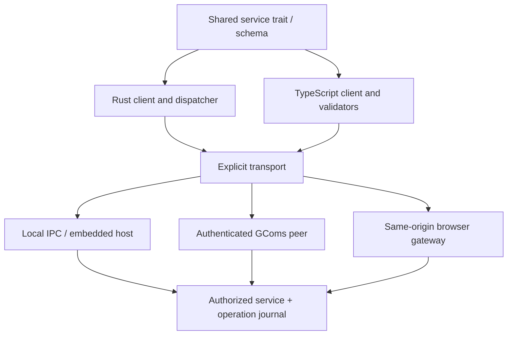

# Architecture and trust boundaries

Applications normally depend on the typed service layer or SDK. They do not need
to import routing internals. Contract crates can be shared between server, native
client and Rust/WASM frontend; TypeScript bindings come from the same schemas.

A transport establishes the caller identity. The router authorizes every method
and status query. Services receive authenticated CallContext; a request field is
never accepted as proof of identity. Scoped SDK routes add component authorization;
RPC cannot grant a missing route or capability.

The browser gateway authenticates the application session and binds it to one
configured service instance and destination. It must not accept an arbitrary
upstream address, socket, contact card or caller identity from request JSON.
Local IPC authenticates the OS peer; separate users, sandboxing or an explicit host
registry are needed when mutually untrusted addons share a machine.

`ComponentAuthority` is a local host callback for retained component-profile
migration. It must validate the profile identity, exact routing policy, purpose,
freshness and revocation against independently configured trust. It is installed
through a native NodeHandle, never selected through RPC or IPC. Core retains sealed
ownership, durable-before-publish transitions and incompatible-state rejection.
The public library does not implement Ghost's certificate format or installer.

`InstalledNetwork` is caller supplied. HTTPS authenticates discovery servers;
installed signing roots authenticate signed network defaults. Invitations do not
supply their own independent trust root. GChat owns the default network document.
Cryptography, invitation trust and operator availability are separate concerns.
