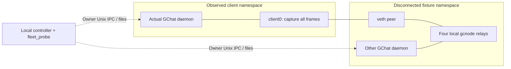

# Renewal review and isolated GChat client capture

Review date: 2026-09-20. Source: GComs `66ee8c9`, including runtime repair
`d6f5d97`; GChat `a0da565`, including `200cd7a`. This is a local review and
capture feasibility assessment. The fleet worker retains the reserved campaign
window. No production or fleet test was started, and no runtime was changed.

## Recovery review

The repair correctly distinguishes missing protected routes from lost terminal
queue authority in both subscription pumps. It neither extends an expired
capability nor introduces a direct connection fallback. Accepted natural streams
still reopen existing authority on their fixed deadline. An unsuccessful setup
with unchanged readiness and a usable route still takes the previous inbox or
channel recovery path.

The integrated pair already passed complete Linux CI: 833 GComs Rust cases
(six ignored), 151 GChat Rust cases, and both strict Clippy gates. This assessment
does not turn those results into coverage of every renewal interleaving.

### Recovery can be deferred by an unrelated failed dial

[ReadySlot::drop](../crates/routing/src/gc2/owner.rs) increments the global
readiness revision even when its dial never published a ready entry.
The entry owner retries on its normal 30-second timer.
[SubscriptionRoute::unchanged](../crates/node/src/node/ticks.rs) uses that
global revision to decide whether a failed setup can invalidate authority.
The [natural subscription setup](../crates/node/src/scheduler/gc2.rs)
can take 60 seconds.

Consequently, a healthy retained entry and independent middle can remain usable
while a second retained guard repeatedly fails to connect. A stalled terminal
subscription can see a new revision at every timeout and repeatedly skip genuine
terminal recovery. The same decision is used for contact and channel pumps.
Other expiry/recovery mechanisms may eventually intervene; this is not a claim
that expired leases become usable indefinitely.

This is a source-derived liveness counterexample, not a reproduced failure in
Capacity 02. It warrants a bounded regression before claiming recovery is fully
qualified. First make generation changes describe actual ready-set changes:
a failed attempt which never installed a ready entry must not increment it.
Then test genuine unrelated entry churn as well; merely fixing the no-op removal
does not make a global revision specific to the failed route. Any broader change
should distinguish route loss from authenticated terminal refusal and preserve
background-only entry maintenance.

### Readiness observations are not atomic

Entry insertion/removal releases the entries write lock before publishing the
revision. The pump separately reads a revision and calls `can_route`; selection
also reads directory freshness and clones the ready set. A replacement between
these observations can make a newer usable route appear to have the old revision,
or conservatively postpone recovery for a failure on an unchanged route.

This is an interleaving risk, not a measured frequency or a demonstrated security
bypass. A coherent ready-set generation published under the same lock, plus an
observation API returning the relevant generation and eligibility together, would
improve the invariant. Simply reading the atomic twice cannot close the existing
write-then-publish gap. If stronger guarantees are needed, carry the selected
route generation with the request rather than treating a global counter as
proof of which route failed.

### Missing targeted coverage

The added
[`unavailable_entries_preserve_inbox_and_channel_authority`](../crates/node/src/node/ticks_tests.rs)
starts with no entries. It exercises the early `prepare(None)` branch; it never
opens a subscription. Keep that regression and add:

| Setup | Required observation, for both pumps |
| --- | --- |
| Ready route disappears or is replaced while setup is pending | Preserve exact inbox/channel authority; retry through the normal pump; recover both traffic classes after readiness returns. |
| Ready route stays unchanged; terminal rejects or setup times out | Exercise existing recovery, with no permanent retry of unusable authority. |
| One usable entry plus a repeatedly failed, never-ready second guard | Failed background dials do not change readiness generation or suppress genuine terminal recovery. |
| One usable route plus actual unrelated entry churn | Deferral is justified by the failed route, rather than unlimited churn elsewhere. |
| Authority expires during route loss | No expired subscribe/push; normal authority renewal/recovery remains effective. |

Real channel/subscription renewal already passed in the integrated suite. Actual
hourly credential rollover also involves wall-clock capability freshness; advancing
Tokio's paused timer alone does not establish a new authenticated epoch.

## Smallest useful capture path

Use two disposable local network namespaces, with no connection to a host
interface and no external route:

Four relay identities, on distinct IPs, reuse the already-tested cold
GCRB2/channel topology. The unobserved peer and relays may share the fixture
namespace: separation from the observed client is the essential measurement
boundary. Unique relay ports avoid wildcard-listener conflicts. No SSH, systemd
deployment worker, host NAT/firewall change, or host-network relay is needed.
Capture the other client in a separate mirrored observation if both endpoint roles
are being evaluated.

Reuse the source-bound `gcnode`, `gchat` and `fleet_probe` artifacts from
[scripts/build-fleet-files.py](../scripts/build-fleet-files.py). The existing
[fleet client launcher](../scripts/fleet_files_remote.py) supplies the daemon
arguments and owner IPC pattern; reuse those semantics without its remote
deployment and firewall machinery. Drive actual invite/join, chat,
import/offer/accept/export and independent SHA-256 checks through the probe.
Run application binaries as the owning user; limit elevated setup to namespace
and capture operations, with a bounded watchdog and verified child cleanup.
Do not use `--local-fixture` or replace the GChat file engine with benchmark chunks.

There is an address-policy constraint: production GCRB2 directories reject
loopback, private, documentation and benchmarking relay addresses.
`--allow-frwd-private-cidr` does not change that policy, and the standalone
daemon rejects private-forwarding configuration. Preserve the production binary:
assign public-policy-valid addresses to the *disconnected fixture only*, with
explicit local routes. Validate namespace identities, link ownership and absence
of external connectivity before launch. Never install those addresses/routes in
the host namespace. The private addresses in the tooling smoke below prove only
the namespace/capture mechanism, not GChat production startup.

The smallest first scope uses a private GCRB2 file, `GC_GC2_CARRIER=true`,
production profile 22, fixed listener and `--no-network-bootstrap`. Clear
inherited bootstrap/provider configuration and bind exact settings in the
manifest. Keep the production scheduler and cover mode. Label this scope
**isolated GChat daemon with explicit bootstrap**, not installed-default desktop.
Installed HTTPS bootstrap, names, automatic router mapping and catalog paths
remain separate required coverage; the known bootstrap/catalog migration gaps
are recorded in [GCHAT_TRAFFIC_PATHS.md](GCHAT_TRAFFIC_PATHS.md).

## Capture and analysis changes needed

1. **Boundary and lifecycle.** Start capture before the daemon, keep it through
   shutdown and drain, and keep equal process and measurement lifetimes across
   all four workloads. Use one dedicated data interface initially, record every
   interface/address/MAC, and reject undeclared interfaces or namespace members.
   Retain loopback separately as a diagnostic; it is not traffic observable on
   the external client link. Use a private mount/resolver configuration so host
   resolver IPC cannot move DNS outside the recorded boundary.
2. **Complete packet accounting.** Capture without a relay/port filter. Include
   IPv4, IPv6, DNS, failed connections, multicast and LAN control packets.
   The current parser filters to IP/IPv6 and its address-based direction helper
   can omit multicast. Add link/interface direction and explicit non-IP
   accounting; unexplained frames must fail validity, not silently disappear.
   Record offload settings, snap length, truncated/malformed frame counts,
   capture loss and decoder versions. Do not treat zero kernel drops alone as
   proof that the pcap contains every delivered packet.
3. **Observer-only connection features.** The file classifier currently uses
   pooled SYN/reset counts plus private `entry_connections` and
   `middle_connections` counters. These are not a single client's observation,
   and the packet representation has no FIN or lifetime feature. Extend parsing
   and analysis for bidirectional flows, SYN retransmissions/tuple reuse,
   FIN/RST closes, setup failures and left/right-censored lifetimes. Derive
   features only from the observed link. Keep internal relay counters as
   correctness diagnostics, excluded from classifier inputs.
4. **Application receipts and matching.** Bind binary/source/configuration
   hashes, profile 22/GCRB2 diagnostics, readiness, workload start/end,
   attempted/sent/acknowledged chat IDs, file identity/length/export hash and
   authenticated terminal acceptance. Both bulk runs use the same file and offer,
   acceptance, receiver and retention policy; only chat differs. Match fresh or
   retained state and elapsed time relative to hourly rollover. Randomize
   workload order and reset state between independent runs. Seeds must not
   collapse cryptographic identities or independent transport randomness.
5. **Fail-closed scope and statistics.** Give the new harness an explicit scope
   version. Reject pooled captures in the client analysis, even when their
   delivery accounting passes. Keep validity separate from gate outcome.
   Preserve the accepted upper 95% confidence bound of 0.55 for idle/chat and
   matched bulk/mixed, for traffic windows and connection counts/lifetimes.
   A threshold failure remains nonzero. No diagnostic or calibration run can
   set `release_qualified=true`.

The smallest implementation is a new local orchestration driver, a strict
client-scope manifest/validator, and packet/connection feature extensions.
No wire-format, cover-volume or scheduler change is needed to establish this
observation boundary. Keep the pooled diagnostic tools for their existing use;
changing their scope label is not a migration.

## Local feasibility result and next checkpoint

A bounded socket-only smoke verified the two-namespace/veth design on this
workstation. Unprivileged user-namespace mapping is denied; `sudo -n unshare --net`
works. Both veth ends were created inside the disposable outer namespace.
IPv4 and IPv6 TCP exchanges crossed the client interface; a fixture-only
loopback sentinel did not appear in its pcap. Host interface identities remained
unchanged, both child processes exited and the namespaces were not persisted.
No GChat or relay process was launched.

The successful capture contains 25 frames, 23 IP packets, two TCP connections
and four FIN packets. Current address-only accounting leaves one IP packet
unattributed and excludes two non-IP frames; link direction accounts for all
25. This confirms that a client namespace alone is insufficient without parser
changes. The first attempt also caught a capture-drain issue: a quick stop
recorded zero frames despite 26 packets received by the filter and zero kernel
drops. The passing attempt used immediate capture delivery and observed payload
sentinels. Both attempts are retained; this smoke is not privacy evidence.

Evidence: `target/gc2-requalification/client-observer-review/`, including
`topology_smoke.py`, `smoke-02/receipt.json`, `parser-receipt.json` and
`boundary-accounting.json` under that successful-run directory.
Pcap SHA-256:
`b2d4afe993a3a6699a5d4e37c1190fb8f77baf8fe744302b748a2c12aebb248d`.

Next, implement the local daemon driver and accounting changes, then run exactly
one matched idle/chat/bulk/mixed quartet as a validity calibration. Require
correct application receipts, isolation, lifecycle and complete observer
accounting before allocating a training/held-out matrix. Four captures at one
seed establish no statistical privacy bound. Retain the accepted release
matrix, confidence criterion and installed-client gates after calibration; do
not spend 64 more runs on the pooled benchmark.
